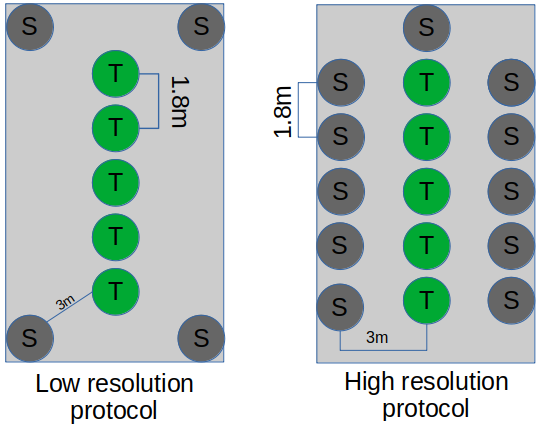
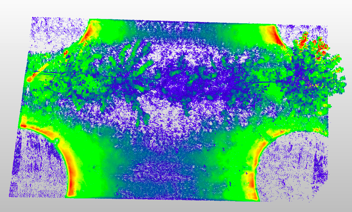
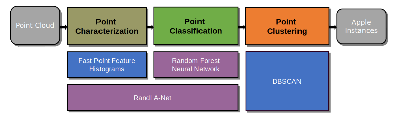
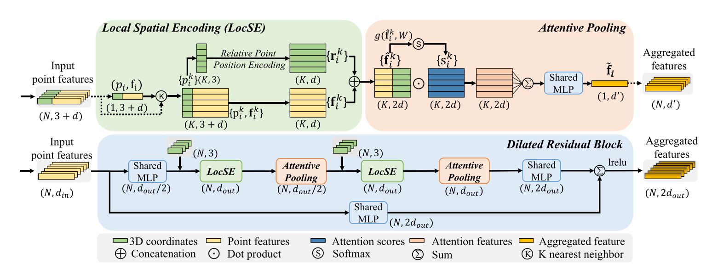
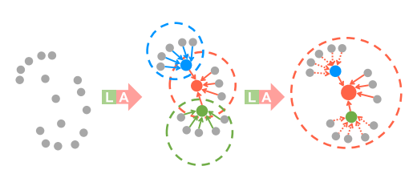

# The Fruithunter pipeline

## Overview

The fruithunter pipeline was developed to segment and count apples from point clouds resulting of scans of apples orchards. Different measurement protocols were considered for orchard scans. As illustrated in figure 1, two main protocol were considered. In the first one, scans are positionned every five trees in the middle of the surounding rows. In the second protocol, scans are performed from close positions in the left and right rows of each tree. The protocols are named low and high resolution protocols respectivelly.

<figure>
    
    <figcaption>Figure 1. Field measurement protocols schematic. Green circles labeled with a "T" represent the apple trees. Gray circles labelled with an "S" represent the sensor position at the moment of the measurement. The low and hight resolution protocol are presented in the left and right part of the figure respectivelly. </figcaption>
</figure>

Each protocol set different levels of precision in the description of the apples trees. In the low resolution protocol, a gradient of densities can be observed that show decrease of density from the scan positions to trees at longest distances from the scan positions as shown in Figure 2. In this figure, density gradient is represented by colors with blue representing lowest density and red highest one. In the high resolution protocol, all trees have similar point densities. The scans contains different levels of noise due to different phenomena. First, occlusion between elements create missing data. Second, outliers are created from multiple hits from the same lidar beam creating intermediate points. Environmental conditions (wind, lighting) can also create perturbation in the measurement.

By default, X,Y,Z coordinates are infered from Lidar scans but other radiometric features can be considered. In our case, from real scans, reflectance, deviation and amplitude of the signal can be considered for each points. 

<figure>
    
    <figcaption>Figure 2. Point cloud density for the low resolution protocol</figcaption>
</figure>

From this noisy data set, it is not possible to define a simple set of rules to segment apples. To handle this complex signal, different approaches from machine and deep learning are going to be used. The first one will use random forest as a segmentation module and will use the FPFH as a feature descriptor. The second approach will use RandLA-NET, a deep learning model specially designed to consume point clouds with millions of points  and make segmentation of multiple elements in a efficient way. The global workflow of the pipeline could bee see it on figure 3. The Random Forest and RandLA-NET models will be detailled in the following sections.

<figure>
    
    <figcaption>Figure 3. The fruithunter pipeline</figcaption>
</figure>

### Random Forest 

Random Forest is an algorithm composed by <b>N</b> blocks of decision trees. A decision tree will use a feature map and will generate a series of questions to infer the class labels of the sampled points. The idea behind this procedure is to split the data on the features that returns the biggest values for the information gain (IG). The feature splitting will continue until each final node belongs to the same class. To avoid over hitting of the model, decision trees are pruned according to a predefined maximal depth.  The idea of using several decision trees is to minimise the variance of the model without increasing the bias. In general, random forest are considered to have good classification perfomance and scalability. 

In this project random forests are fitted with 33 features (FPFH) or 36 if the radiometric features are added, the model is composed by 300 decision trees and the depth of each decision tree is 15 nodes. 

### RandLA-NET

RandLA-NET is a state-of-the-art deep learning model developed to consume raw point clouds of large size (>1M) and perform segmentation with good accuracy. In order to achieve this objective, 3 new layers were developed as illustrated in figure 4.   

<figure>
    
    <figcaption>Figure 4. RandLA-NET main Layers</figcaption>
</figure>

The <i>local spatial encoding</i> is applied on each point and determine and encode the relative XYZ coordinates of all the neighbouring points with additionnal point features. Particularly this layer allows the network to abstract complex geometries. The <i>Attentive Pooling</i> layer is used to aggregate neighbouring point features using attention score for each feature. At the end these two layers will generate a informative feature vector with the most representative features and points. Finally the <i>Dilated residual block</i> will be in charge of stacking and propagating the features vector to neighboring points to increasing the receptive field that represent each point. A graphical representation of this process could be see it in the figure 5. 

<figure>
    
    <figcaption>Figure 5. Dilated residual block, Global feature extraction</figcaption>
</figure>


### Clustering 

To count the number of fruits, a clustering algorithm is used. The <i>DBSCAN</i> algorithm was chosen as it groups the segmented points in different clusters based on spatial density. 

DBSCAN is parameterized with two main elements: a distance threshold (<i>eps</i>) that specifies how close should be a group of points to be in the same cluster, and a minimum number of points to consider a region as dense.  


## Installation 

To install the fruithunter pipeline and its dependencies must be followed the foollowing steps:

<ol>
    <li> Create a virtual environment with <a href="https://docs.conda.io/">conda</a> :<br>

```bash
conda create -n fruithunter  -c conda-forge -c anaconda python=3.6 scikit-learn scipy numpy pytest jupyter pandas matplotlib pcl cmake eigen boost tensorflow-gpu=1.13.1 PyYAML=5.1.2 cython=0.29.15 h5py=2.10.0
```
      
  <li> Activate the conda environment <br>

```bash
conda activate fruithunter
```
      
  <li> Install final dependency of Randla-NET <br>

```bash
pip install open3d-python==0.3.0
```
      
  <li> Retrieve the source code of fruithunter:

```bash
git clone https://forgemia.inra.fr/openalea_phenotyping/fruithunter.git
cd fruithunter/
```

  <li> Compile the package for the feature extraction (FPFH):
      

   - Create the build folder: <br>

```bash
mkdir pcl/build
```
   - Generate the cmake file: <br>

```bash
cd pcl/build; cmake .. ; make ; cd -
```
     
  <li> Compile the wrappers for Randla-NET:

```bash
cd randlanet/utils/cpp_wrappers ; sh compile_wrappers.sh ; cd -
```
      
  <li> Install the nearest neighbors module:
      
```bash
cd randlanet/utils/nearest_neighbors/ ; python setup.py install ; cd -
```
  <li> Install the pcl and randlanet modules:

```bash
python setup.py develop
```
      
<ol>
